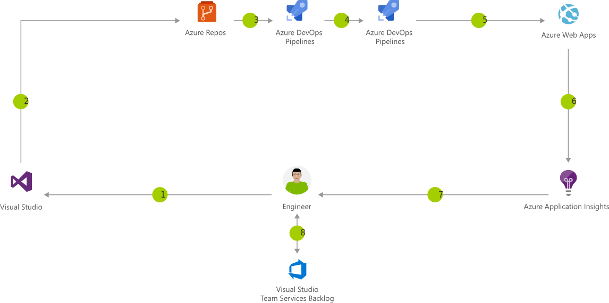

# CI/CD for Azure Web Apps
[doc reference:](https://docs.microsoft.com/en-us/azure/architecture/solution-ideas/articles/azure-devops-continuous-integration-and-continuous-deployment-for-azure-web-apps)
## Azure Pipeline (YAML)
The most common and demonstrated pipelines are those that contain multiple stages, for me these are not providing a complete vision on howto setup, use and maintain pipelines. The samples often show 3 stages, Build-DeployTest-DeployProduction. 

Azure Pipelines can provide so much more then just those 3 stages.

## Azure Pipeline (Classic)
Not advised by MS to use as your preferred way to go, the advise is to use something ([YAML](https://docs.microsoft.com/en-us/azure/devops/pipelines/yaml-schema)) 
### n00bs Should always use this to get started
When you are new to the Azure Pipelines/Build/Deploy mechanics you should certainly use this to jumpstart your OPS treeswinging adventure. It will allow you to focus on getting the job done and not on using YAML in the correct way.
### Experienced monkeys should use it as well
When you are experienced in the operations of the Azure Pipeline this will help you to get the correct setup in a visual way. After that it is easy to get the YAML format of the task you have implemented.

## Azure Pipeline - howto setup
1. Think about what main stages the pipeline will handle

  - Build (build, run unittests, publish artifacts)
  - Provision (create azure infrastructure/resourcegroup)
  - Compliancy checking (azure compliancy/resourcegroup)
  - Deploy (deploy webapp)
  
2. Create the stages in a yaml file : pipeline.yml
3. Run the pipeline to see the stages succeed

## Azure Pipeline - howto implement stages
When samples say more then a thousand worded lines go [get the sample pipeline](samplepipeline.yml) from github.

